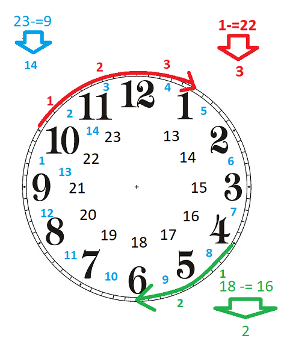

 # Project: General Hospital Pre-Triage Application
- Version 0.9

Because of the pandemic and prevention of the spread of COVID19, hospitals need to screen the patients and separate those in need of COVID-test from others. This has to be done in an orderly fashion by letting the patients know what is the expected wait time and let them know when they can be admitted. 

Your task is to help complete the implementation of the Pre-Triage application. 

## The Pre-Triage Application
The application starts by displaying a simple menu with three options:
```Text
General Hospital Pre-Triage Application
1- Register
2- Admit
0- Exit
>
```
### Register
The register option is selected to screen patients before getting into the hospital. The user can select between a COVID Test or Triage.

COVID test is selected if the patient is at the hospital for a COVID Test. In this case, the patient's name and OHIP number is entered and then a ticket will be printed with a call number and estimated time of admission for the patient.

If Triage is selected then in addition to the patient's name and OHIP number, the symptoms of the patient are entered. Then a ticket for Triage is printed with an estimated time of admission.

### Admit
Admit is selected when the COVID Test area or the Triage section is ready to accept a patient. After selecting COVID or Triage, the patient with the next ticket in line will be called. Based on the time of the call, the average wait time for the next patient for that line up (COVID or Triage) will be updated.

## Milestones and due dates
The project will be done in 4 or 5 milestones and each milestone will have its due date. The due date of each milestone will be announced when it is published, and it is based on the amount of work to be done for that milestone. 

## Citation, Sources

When submitting your work, all the files submitted should carry full student information along with the "citation and sources" information. See the following example:

```C++
/* Citation and Sources...
Final Project Milestone ? 
Module: Menu
Filename: Menu.h
Version 1.0
Author	John Doe
Revision History
-----------------------------------------------------------
Date      Reason
2020/?/?  Preliminary release
2020/?/?  Debugged DMA
-----------------------------------------------------------
I have done all the coding by myself and only copied the code 
that my professor provided to complete my workshops and assignments.
-----------------------------------------------------------
OR
-----------------------------------------------------------
Write exactly which part of the code is given to you as help and 
who gave it to you, or from what source you acquired it.
-----------------------------------------------------------*/
```

## Compiling and Testing Your Program

All your code should be compiled using this command on `matrix`:

```bash
g++ -Wall -std=c++11 -g -o ws file1.cpp file2.cpp ...
```

- `-Wall`: compiler will report all warnings
- `-std=c++11`: the code will be compiled using the C++11 standard
- `-g`: the executable file will contain debugging symbols, allowing *valgrind* to create better reports
- `-o ws`: the compiled application will be named `ws`

After compiling and testing your code, run your program as following to check for possible memory leaks (assuming your executable name is `ws`):

```bash
valgrind ws
```

To check the output, use a program that can compare text files.  Search online for such a program for your platform, or use *diff* available on `matrix`.

> Note: All the code written in the project must be implemented in the **sdds** namespace.

## Project Implementation notes:  *Very Important, read carefully*
-	All the code written in this project should be within the namespace sdds.
-	You are free and encouraged to add any member variables or member functions you find necessary to complete your code. If you are not sure about your strategy for adding functionalities and properties to your classes, ask your professor for advice.  
-	A module called **utils** is added to the project with two functions that can be used in your implementation. As mentioned before, you can add any custom code of your own to the **utils** module to be used throughout the project. Also, because the application works with real system time, for debugging purposes a global **sdds::debug** flag is added to the utils module. (see Time module for more information)<br/>
You are free to use this flag for your own debugging messages.
 **utils.h** will be included in all the testers of the milestones. 
-	Unless you are asked for a specific definition, name the variables, and functions yourself. Use proper names and follow the naming conventions instructed by your professor. Having meaningless and misleading names will attract a penalty.
-	Throughout the project, if any class is capable of displaying or writing itself, the member function will always have the following signature: 
The function will return a reference of an **ostream** and will receive a reference of an "ostream" as an argument.  
-	Throughout the project, if any class is capable of reading or receiving its content from a stream, the member function will always have the following signature: 
The function will return a reference of an **istream** and will receive a reference on an **istream** as an argument.  
-	When creating methods (member functions) make sure to make them constant if in their logic, they are not modifying their class.
-	When passing an object or variable by address or reference, if they are not to be modified, make sure they are passed as constant pointers and references.
-	If an Empty state is required for an object, it is considered to be an “invalid” empty state, and objects in this state should be rendered unusable.

# Milestone 1 

## Time Module
The time module is designed to:
- read and write time.
- measure the passage of time
- calculate the estimated wait time

The time module only holds the time in minutes but will display and read the time in the following format:  
```Text
HH:MM
```
For example, when the Time object holds the value 125, it will display **02:05**. Likewise if the time **13:55** is read by the Time object from a stream, **835** is stored in the object (i.e. 13x60+55). Note that since the Time object is also used for the passage of time, there is no limit to the number of minutes and it may pass 24 hours if needed.  
> Note: **125:15** is a valid time that means **125** hours and **15** minutes also **0:96** is a valid entry and it is displayed as: **01:36** that is **1** hour and **36** minutes

Complete the implementation of the Time class with the following mandatory specs:  

```C++
  class Time {
      unsigned int m_minutes ;      // holds time in minutes 
   public:
      void reset();  
      Time(unsigned int min = 0); 
      std::ostream& write(std::ostream& ostr) const;
      std::istream& read(std::istream& istr);
      operator int()const;
      Time& operator *= (int val);
      Time& operator-=(const Time& D);
   };
```
```C++
Time& reset();  
```
Resets the **Time** to the current time using **sdds::getTime()** (available in **utils** module) and then returns the reference of the current object.
> Note that if the **sdds::debug** is set to true, the **getTime()** function will receive the time from the user instead. This will be used for debugging purposes and when submitting your work through the submitter program.
```C++
Time(unsigned int min = 0); 
```
Constructs the Time by setting the number of minutes held in the object or set the time to zero by default.
```C++
std::ostream& write(std::ostream& ostr) const;
```
Writes the time into a stream in HH:MM format padding the spaces with zero if
the numbers are single digit (examples   03:02, 16:55  234:06 )
```C++
std::istream& read(std::istream& istr);
```
Reads the time form a stream in H:M format. It makes sure that the two integers (hours and minute) are separated by ":", otherwise it will set the **istream** object in a failure state. (see the steps below to see how)

Note that this function does not react to any invalid data. It simply follows these steps:
- reads the integer for the hours using **istr**
- reads one character and makes sure it is **':'**, if it is not is will set the **istream** object a failure state by issuing this command: ```istr.setstate(ios::failbit);```
- reads the integer for the minutes using **istr**

> Note: Do not clear or flush the **istream** since this method complies with the **istream** standards. The caller of this function may check the **istream** state to make sure that the read was successful if needed.

```C++
operator int()const;
```
if time is casted to an integer, it will return the number of minutes.
```C++
Time& operator*= (int val);
```
Multiplies the Time by **val**, then returns the reference of the current object.
```C++
Time& operator-= (const Time& D);
```
Calculates the time difference between the current time and the incoming argument Time **D**. Note that the difference can never be a negative value:<br/>
23:00 -= 9:00 will be **14:00**.<br />
18:00 -= 16:00 will be **2:00**.<br />
1:00 -= 22:00 will be **3:00**.  ((**1:00** + 24:00) - **22:00**)<br /> 
See the illustration below:


```C++
operator<<
```
Overload the insertion operator to be able to insert a Time object into an ostream object 
```C++
operator>>
```
Overload the extraction operator to be able to extract data from an istream object into the Time object

## timeTester.cpp execution sample
```Text
E: 00:00
D: 23:05
C: 01:05
  D        C     D-=C
23:05 -= 01:05 = 22:00
  C        D     C-=D
01:05 -= 22:00 = 03:05
C: 03:05
 C *= 2
06:10
 C *= 12
74:00
Please enter the time (HH:MM): 22:33
you entered: 22:33
Enter current time: 12:00
12:00
Actual system time is: 01:15  
```
> Note: the last value **01:15** changes based on the system's time.
## Menu Module
Menu class encapsulates a menu and provides selection functionality for the caller program.

```C++
 class Menu{
      char* m_text; // holds the menu content dynamically
      int m_noOfSel;  // holds the number of options displayed in menu content
   public:
      Menu(const char* MenuContent, int NoOfSelections);
      virtual ~Menu();
      std::ostream& display(std::ostream& ostr = std::cout)const;
      int& operator>>(int& Selection);
   };
```

```C++
 Menu(const char* MenuContent, int NoOfSelections);
```
Dynamically allocates memory to hold the content pointed by **m_text**. Also keeps the number of Selections in **m_noOfSel**.
```C++
 ~Menu();
```
Deallocates the dynamically allocated memory.
```Text
Copy and assignment
```
Makes sure the Menu can not be copied or assigned to another Menu.  object
```Text
display
```
Displays the Menu content and then in a new line, it displays:

```Text
0- Exit
> _
```
```C++
int& operator>>(int& Selection);
```
The member insertion operator first calls the display function and then receives the user's selection as an integer value. The integer reference **selection** argument is then set to this value and returned.<br />
Make sure that the entered value is validated as an integer and also the value should be between 0 and **m_noOfSel**.<br />
If the above conditions are not met, a proper error message should be displayed and re-entry requested(see below)

Assuming that the menu content is set to:```"Tester Options menu:\n1- Option one\n2- Option two\n3- Option three"``` and the number of selections is set to 3 the **operator>>** should run like this:
```Text
Tester Options menu:
1- Option one
2- Option two
3- Option three
0- Exit
> abc
Bad integer value, try again: -1
Invalid value enterd, retry[0 <= value <= 3]: 4
Invalid value enterd, retry[0 <= value <= 3]: 2
```
## menuTester.cpp execution sample
```Text
Tester Options menu:
1- Option one
2- Option two
3- Option three
0- Exit
> -1
Invalid value enterd, retry[0 <= value <= 3]: 4
Invalid value enterd, retry[0 <= value <= 3]: abc
Bad integer value, try again: 2
option two selected

Tester Options menu:
1- Option one
2- Option two
3- Option three
0- Exit
> 1
option one selected

Tester Options menu:
1- Option one
2- Option two
3- Option three
0- Exit
> 3
option three selected

Tester Options menu:
1- Option one
2- Option two
3- Option three
0- Exit
> 0
goodbye!
```
## ms1Tester.cpp Execution Sample 
> Use these data entry for your submission.
```Text
Menu tester -----------------------------------------
Tester Options menu:
1- Option one
2- Option two
3- Option three
0- Exit
> -1
Invalid value enterd, retry[0 <= value <= 3]: 4
Invalid value enterd, retry[0 <= value <= 3]: abc
Bad integer value, try again: 2
option two selected

Tester Options menu:
1- Option one
2- Option two
3- Option three
0- Exit
> 1
option one selected

Tester Options menu:
1- Option one
2- Option two
3- Option three
0- Exit
> 3
option three selected

Tester Options menu:
1- Option one
2- Option two
3- Option three
0- Exit
> 0
goodbye!
Time tester -----------------------------------------
E: 00:00
D: 23:05
C: 01:05
  D        C     D-=C
23:05 -= 01:05 = 22:00
  C        D     C-=D
01:05 -= 22:00 = 03:05
C: 03:05
 C *= 2
06:10
 C *= 12
74:00
Please enter the time (HH:MM): abc
Bad time entry, retry (HH:MM): 12.33
Bad time entry, retry (HH:MM): 12:33
you entered: 12:33
Enter current time: 12:00
12:00
Actual system time is: 01:15
```
> Note: the last value **01:15** changes based on the system's time.

## MS1 Submission and due date
Milestone 1 is due on Friday Nov 13th, 23:59.

Upload your source code and the tester program (**utils.cpp, utils.h Menu.cpp,Menu.h, Time.cpp, Time.h and ms1Tester.cpp**) to your `matrix` account. Compile and run your code using the `g++` compiler as shown above and make sure that everything works properly.

Then, run the following command from your account (replace `profname.proflastname` with your professor’s Seneca userid):
```
~profname.proflastname/submit 244/prj/m1
```
and follow the instructions.

> **:warning:Important:** Please note that a successful submission does not guarantee full credit for this workshop. If the professor is not satisfied with your implementation, your professor may ask you to resubmit. Re-submissions will attract a penalty.

